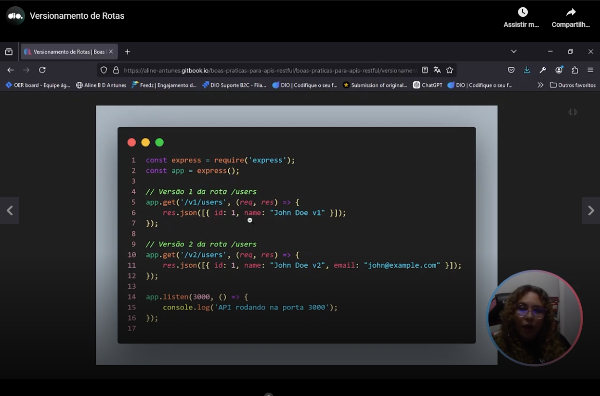
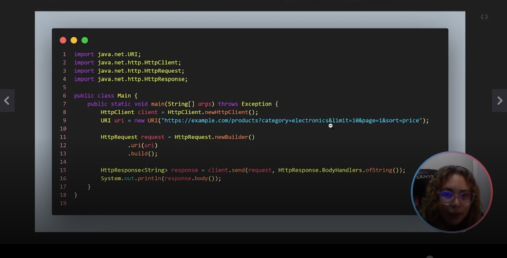
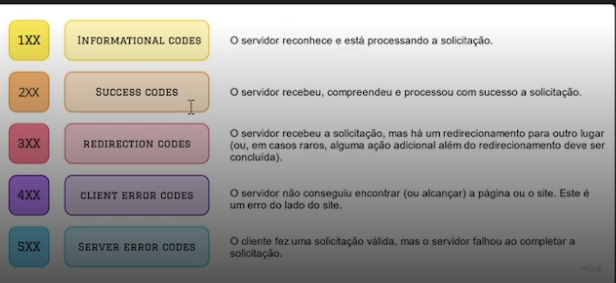

# Roy Thomas Fielding

Roy Thomas Fielding is credited with defining the REST architectural style in his 2000 doctoral dissertation. He is considered the "creator" of the REST architectural style itself.


# Stateless

To be stateless is a characteristics of a REST API.


# Extra material

I suggest you to access [this material](https://aline-antunes.gitbook.io/boas-praticas-para-apis-restful) if the teacher that explains some concepts related to REST APIs, link good and bad pratices as the following image.


Some concepts that the teacher Aline explained in the classes, like that we must use plural names of resources and without an HTTP verb in the name ("getUsers", with "get" in the name of the route, is wrong as example).


# Use of noons to represent resources

With a random example teacher enforced the necessity of the use of noons (and not verbs, as example), to represent resources.


To be more clear, teacher refered to use of the word "details" in the image of the URL of the previous image.

Teacher said that in case of the use of a verb in a URL we must use a correct verb with the route, as example the verb GET with the route "/users" instead ot the 
route "/getUsers".


# Route versioning

Teacher showed an example o route versioning, the part "v1", "v2" etc in the URL. Example:




# Query parameters

Teacher said about the use of query parameters using the characters "?" and "&" in the URL:



But teacher said about things that do not are very common, like in the next URL where we receive a form to change an user. I am talking about the id 1 in the URL:

```
http://10.0.0.1/users/1/edit
```


# Groups of HTTP status codes




# REST APIs returning HTML

A conversation with Chat GPT about this question: [link](https://chatgpt.com/share/68b19ce5-4444-8007-985e-faecd492c154).


# 7 Boas Práticas Para APIs RESTful Profissionais article

[link](https://www.dio.me/articles/7-boas-praticas-para-apis-restful-profissionais)